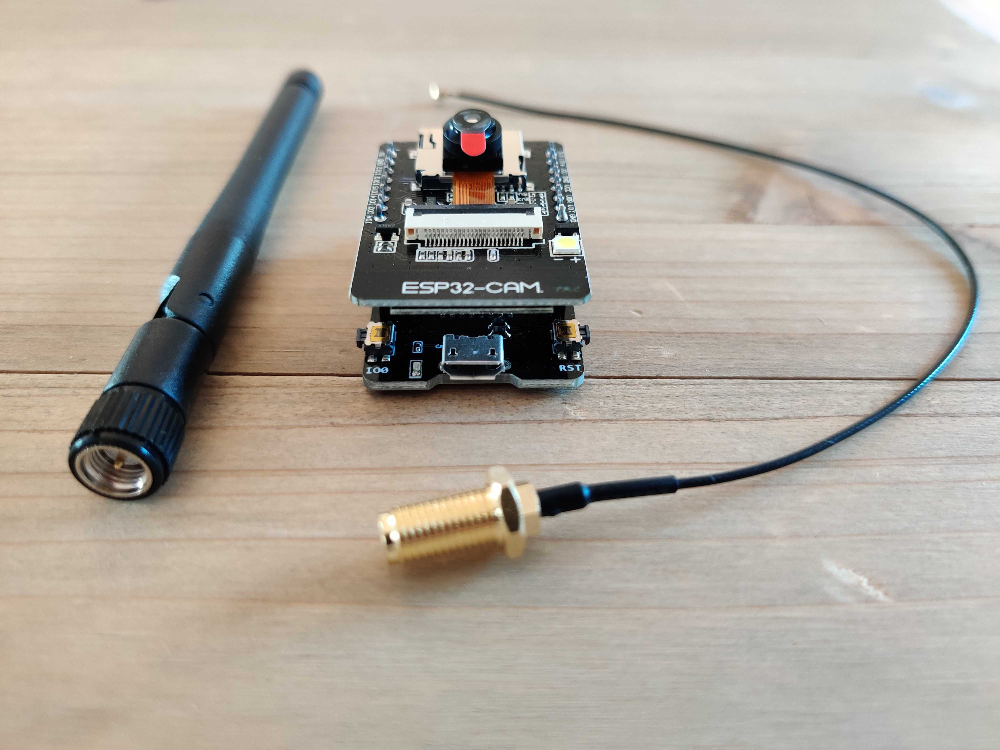
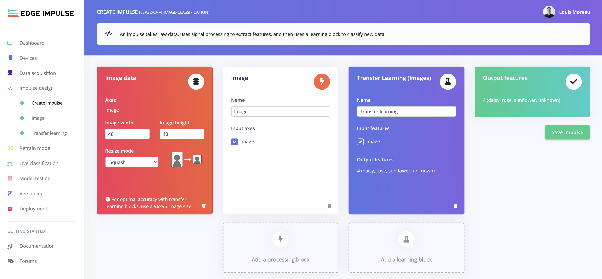
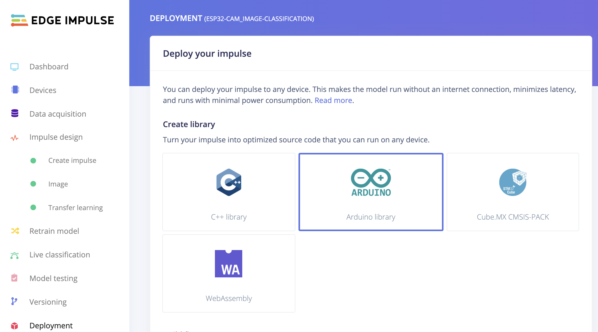
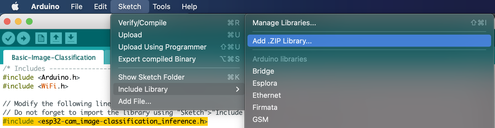
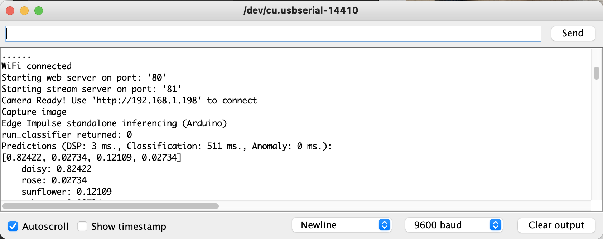
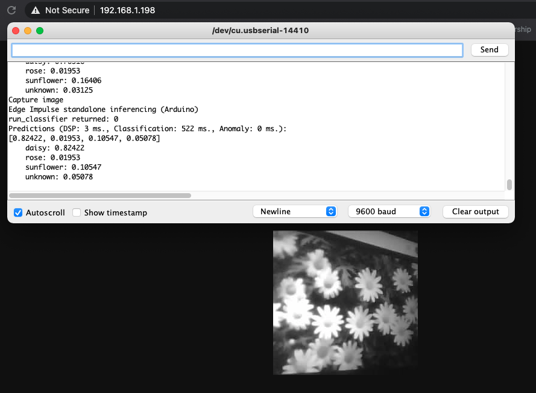
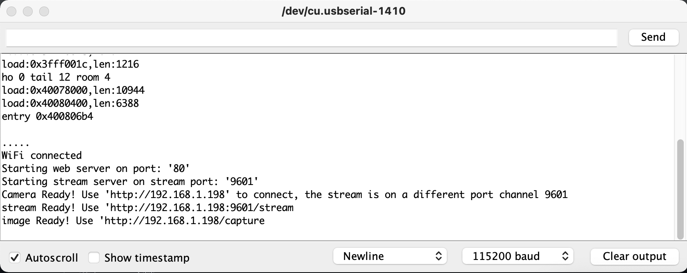
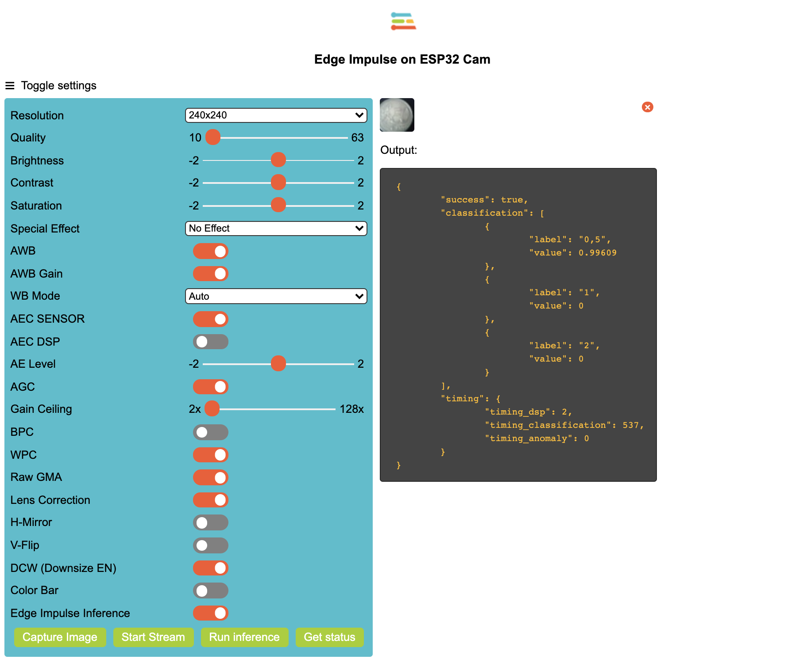
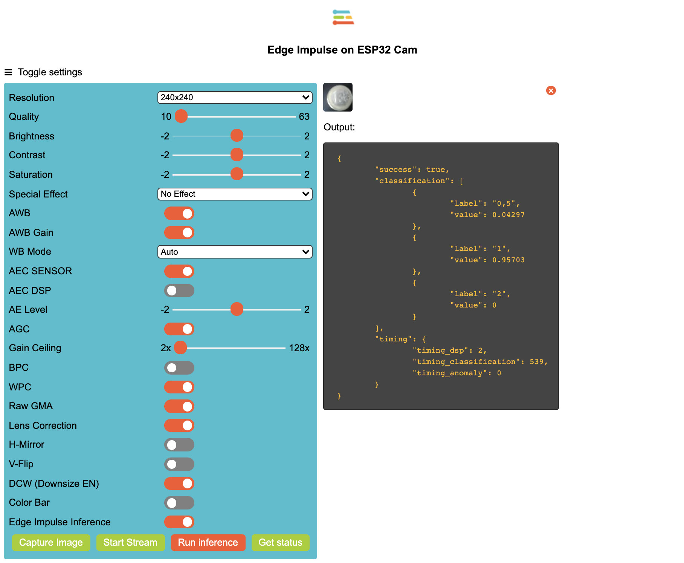

# ESP32 Cam and Edge Impulse

How to run custom inference on a ESP32 cam using Edge Impulse. 

### Material



This code has been tested the AI Thinker ESP32 Cam module. It should work the same with the Wrover board or an board that has PSRAM. 

To use this board, please select your board in the Arduino code the following lines:

```
// Select camera model

#define CAMERA_MODEL_WROVER_KIT // Has PSRAM
//#define CAMERA_MODEL_ESP_EYE // Has PSRAM
//#define CAMERA_MODEL_M5STACK_PSRAM // Has PSRAM
//#define CAMERA_MODEL_M5STACK_V2_PSRAM // M5Camera version B Has PSRAM
//#define CAMERA_MODEL_M5STACK_WIDE // Has PSRAM
//#define CAMERA_MODEL_M5STACK_ESP32CAM // No PSRAM
//#define CAMERA_MODEL_AI_THINKER // Has PSRAM
//#define CAMERA_MODEL_TTGO_T_JOURNAL // No PSRAM
```

## Steps

* Create your Image Classification model using [Edge Impulse](https://edgeimpulse.com).

*Due to the board limitations, you may need to train your model with 96x96 images and use the MobileNetV1 0.01:*



* Download the Arduino library under the `Deployment` tab in the Edge Impulse studio


### Basic Image Classification Example

*Note: On Sept 9th 2021, the issue predicting always the same classes has been fixed*

* Open the `Basic-Image-Classification.ino` file under the `/Basic-Image-Classification` folder.
* Import the .zip library you have downloaded from Edge Impulse Studio

* Change the `#include <esp32-cam_image-classification_inference.h>` line according to your project name.
* Compile and deploy the code to your board
* Open the serial monitor and use the provided IP to capture an image and run the inference:



### Advanced Image Classification Example (Deprecated)

*Note: 
Deprecated since Basic Example has been fixed and also support bilinear interpolation technique to resize the frame.*

*Note 2: 
Here we use the ESP SDK to resize the image in RGB888 format using the bilinear interpolation technique. You can see the funtion declaration [on Espressif's Github repository](https://github.com/espressif/arduino-esp32/blob/master/tools/sdk/esp32/include/esp-face/image_util/include/image_util.h#L335)*.

* Open the `Basic-Image-Classification.ino` file under the `/Advanced-Image-Classification` folder.
* Set your WIFI credentials
* Navigate to the `app_httpd.cpp` tab.
* Import the .zip library you have downloaded from Edge Impulse Studio like on the previous example:

* Change the `#include <euros_coins_classification_inference.h>` line according to your project name.
* Compile and deploy the code to your board
* Open the serial monitor and use the provided IP to capture an image and run the inference:

* On your brower navigate to the IP provided by your Serial Console
* Use the toggle button to activate the `Edge Impulse Inference` (you need to select an image resolution lower or equal to QVGA).
* Click on `Run inference`:



## Ressources

*Note: Theses tutorials / repositories have been used to create this project:*

- [TinyML ESP32-CAM: Edge Image classification with Edge Impulse](https://www.survivingwithandroid.com/tinyml-esp32-cam-edge-image-classification-with-edge-impulse/) 
- [https://github.com/v12345vtm/esp32-cam-webserver-arduino-simplified-arduino-html](https://github.com/v12345vtm/esp32-cam-webserver-arduino-simplified-arduino-html)
